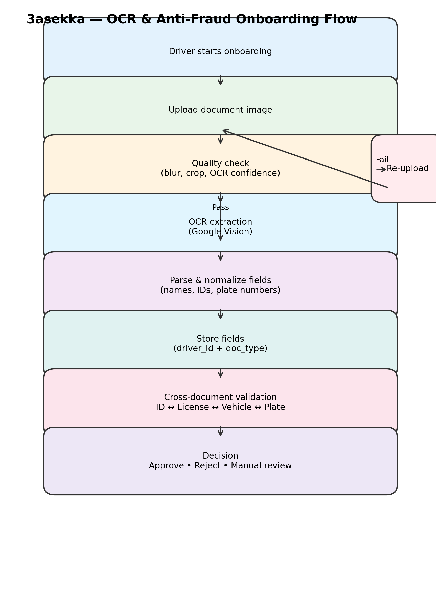

  

  

> **Visual overview of the OCR-based driver onboarding and anti-fraud validation flow.**
> ## Anti-Fraud Rules (Examples)

- IF national_id.name ≠ driving_license.name → Flag for manual review
- IF plate_number not linked to driver → Reject registration
- IF OCR quality < threshold → Request re-upload
- IF any document belongs to a different identity → Block approval

## Contents
- [1) OCR & Anti-Fraud](#1-ocr--anti-fraud)
- [2) Admin Dashboard](#2-admin-dashboard)
- [3) Booking System](#3-booking-system)
- [4) Payment Flow](#4-payment-flow)
- [5) API + Mobile Flow](#5-api--mobile-flow)

# 3asekka (ع السكة) — OCR & Anti-Fraud Case Study

## Overview

---

## 1) OCR & Anti-Fraud
**What it covers**
- OCR document scanning
- Identity verification
- Cross-document validation
- Fraud detection rules

**Used for**
- KYC systems
- Logistics & transportation apps
- Fintech onboarding

---

## 2) Admin Dashboard
**What it covers**
- Admin review & moderation
- Manual approve / reject
- Status tracking
- Audit logs

**Used for**
- Internal dashboards
- Operations & support teams

---

## 3) Booking System
**What it covers**
- Booking lifecycle
- Availability & assignment
- Cancellation & rescheduling
- Notifications

**Used for**
- Clinics
- Cleaning services
- Appointment-based apps

---

## 4) Payment Flow
**What it covers**
- Payment status handling
- Validation & error handling
- Refund logic
- Fraud-aware checks

**Used for**
- Service platforms
- Marketplaces
- E-commerce systems

---

## 5) API + Mobile Flow
**What it covers**
- REST APIs
- Mobile onboarding flow
- State management
- Error handling

**Used for**
- Flutter / mobile apps
- Backend systems

3asekka is a transportation and logistics platform in Egypt.
This case study focuses on the driver onboarding and verification flow,
specifically how OCR is used to extract data, validate documents, and prevent fraud
by ensuring all submitted information belongs to the same driver.

> ⚠️ No source code is shared here to protect client confidentiality.

---

## Core Problem
Driver onboarding is a common fraud entry point:
- Fake identities
- Using another person’s driving license
- Registering vehicles not owned or not related to the driver
- Uploading unclear or manipulated documents

The challenge was to **automatically detect inconsistencies** before approval.

---

## Solution Approach

### 1️⃣ OCR Document Scanning
Each driver is required to upload multiple documents:
- National ID
- Driving License
- Vehicle License
- Vehicle photos (supporting verification)

OCR is used to extract structured data from each document.

---

### 2️⃣ Data Extraction & Normalization
Extracted OCR data is parsed into structured fields such as:
- Full name
- National ID number
- License numbers
- Plate number
- Expiry dates

All data is normalized before validation to avoid false mismatches
(e.g. spacing, Arabic/English variations).

---

### 3️⃣ Cross-Table Validation (Anti-Fraud Logic)
To ensure **all data belongs to the same driver**, multiple comparisons are applied:

- National ID ↔ Driving License  
- Driving License ↔ Vehicle License  
- Plate number ↔ Vehicle photo  
- Driver account ↔ all uploaded documents  

Any mismatch triggers a **fraud flag** or **manual review**.

---

### 4️⃣ Quality Control & Re-capture
Before validation, document quality is checked:
- Blurry images
- Cropped documents
- Low OCR confidence

If quality fails, the driver is asked to **re-upload** the document.

---

### 5️⃣ Driver Identity Assurance
All extracted data is linked using:
- driver_id
- document type
- verification status
- review reasons

This guarantees that:
> ✅ All documents belong to the same physical driver  
> ❌ Mixed or stolen identities are rejected

---

## Final Outcomes
- Significant reduction in fake registrations
- Faster approval for valid drivers
- Clear audit trail for every decision
- Safer onboarding process

---

## Tech Stack (High Level)
- Backend: Laravel + MySQL
- OCR: Google Vision OCR
- Mobile Apps: Flutter (Driver & Rider)
- Notifications: Firebase / FCM

---

## Notes
- This repository contains **documentation only**
- No APIs, keys, backend code, or sensitive data are included
