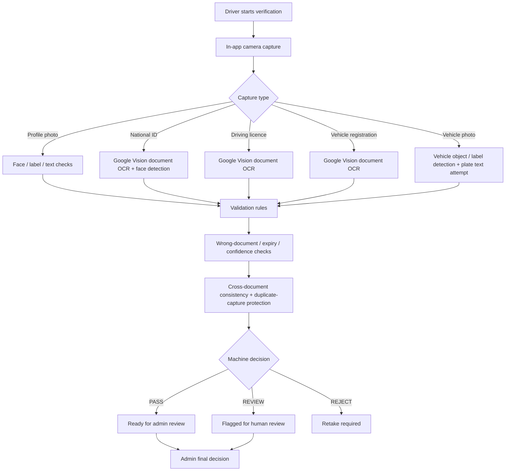

# 3ASEKKA — عالسكة
## Production On-Demand Goods Transportation Platform
### Uber / Careem / inDrive-style operating model for logistics and goods transport

> **VIEW-ONLY PORTFOLIO / CASE STUDY — NOT OPEN SOURCE**
>
> This public repository contains **documentation and reduced presentation visuals only**. It does **not** contain the production application source code, private backend code, credentials, API secrets, signing keys, database secrets, or private user data.
>
> **NO OPEN-SOURCE LICENSE IS GRANTED. ALL RIGHTS RESERVED.** See [`LICENSE`](LICENSE).

**3ASEKKA (عالسكة)** is a production **on-demand goods transportation application** built for the Egyptian market. Its operating model is closer to **Uber, Careem and inDrive** than to an e-commerce marketplace: a customer creates a transport request, selects the required vehicle, chooses pickup and drop-off points, receives a route-based suggested price, drivers can submit competing offers, the customer selects a driver, and the trip proceeds through a real-time operational lifecycle until delivery is completed.

The project is a full operational product — **customer flow + driver flow + owner/admin operations + monetization + AI-assisted verification + real-time infrastructure**.

---

## Visual proof

The image above is a reduced public gallery created from **actual screenshots preserved in the production source archive**. High-resolution originals are kept private.

### OCR / AI verification — camera-first flow

```mermaid
flowchart TD
    A[Driver starts verification] --> B[In-app camera capture]
    B --> C{Capture type}
    C -->|Profile photo| D[Face / label / text checks]
    C -->|National ID| E[Google Vision document OCR + face detection]
    C -->|Driving licence| F[Google Vision document OCR]
    C -->|Vehicle registration| G[Google Vision document OCR]
    C -->|Vehicle photo| H[Vehicle object / label detection + plate text attempt]
    D --> I[Validation rules]
    E --> I
    F --> I
    G --> I
    H --> I
    I --> J[Wrong-document / expiry / confidence checks]
    J --> K[Cross-document consistency + duplicate-capture protection]
    K --> L{Machine decision}
    L -->|PASS| M[Ready for admin review]
    L -->|REVIEW| N[Flagged for human review]
    L -->|REJECT| O[Retake required]
    M --> P[Admin final decision]
    N --> P
```

**Important:** driver documents in this onboarding flow are **captured from the app camera**. They are not presented as a generic gallery/file-upload workflow. OCR and computer-vision processing is performed server-side through Google Cloud Vision.

➡️ **More visuals and technical explanation:** [`SHOWCASE.md`](SHOWCASE.md)

---

# Production identity

- **Android package:** `com.asekka.app`
- **Production version:** `1.1.0`
- **Android versionCode:** `20260815`
- **Mobile:** React Native `0.81` + Expo SDK `54` + React `19`
- **Backend / Database / Realtime:** Supabase — PostgreSQL, Auth, Realtime, Storage, RPCs and Edge Functions
- **Maps / routing / route pricing:** Google Maps + Google Routes
- **OCR / Computer Vision:** Google Cloud Vision through a server-side Supabase Edge Function
- **Push notifications:** Firebase Cloud Messaging (FCM)
- **Location:** Expo Location + Google geocoding

A production Android release exists under the same package identity.

---

# What was built

## 1. Customer transport flow

The customer side supports a complete goods-transport journey:

- Immediate transport requests
- Future scheduling / booking
- Pickup and destination selection on interactive maps
- Saved addresses and stored coordinates
- Cargo description, weight and pickup-floor information
- Vehicle-class selection
- Server-calculated suggested fare
- Backend minimum-price protection
- Promo codes
- Real-time driver bidding
- Bid comparison using price, rating, completed trips and vehicle information
- Accept / reject bid workflow
- Real-time chat and supported calling flows
- Live trip-status tracking and driver-location updates
- Cancellation rules and cancellation finance
- Trip receipts / invoices
- Disputes and support tickets
- Repeat-order flow
- History, analytics and notifications

---

## 2. Four operational vehicle classes

| Vehicle class | Intended capacity shown in the product |
|---|---:|
| Quarter pickup / ربع نقل | up to ~1.5 ton |
| Van / فان | up to ~700 kg |
| Tricycle / تروسيكل | up to ~300 kg |
| Motorbike / موتوسيكل | up to ~50 kg |

Vehicle type participates in the **order flow, driver eligibility and pricing configuration** — it is not just a visual selector.

---

## 3. Smart route-based pricing

The pricing architecture runs server-side and can use:

- Pickup / destination coordinates
- Google Routes road distance
- Route duration
- Toll information when available
- Vehicle-specific pricing profiles
- Admin-configured pricing points
- Minimum driver fare
- Platform commission
- Configurable pricing / return factors
- Configurable rounding rules

The backend returns a suggested customer fare and a minimum allowed offer, supporting an inDrive-style negotiation model while protecting the configured floor price.

---

## 4. Real-time driver bidding

The bidding workflow includes:

- Supabase Realtime subscriptions
- Driver offer amount
- Driver profile / rating / completed-trip information
- Vehicle information
- Customer accept / reject actions
- Closed / expired request protection
- Backend validation around accepted bids
- Global bidding controls
- Driver-level restrictions linked to operational / debt rules

---

## 5. Scheduling / booking

Customers can schedule transport for a later date and time with future-slot validation, route details, vehicle selection and cargo information. Scheduled requests continue into the normal trip lifecycle when activated.

---

## 6. Full trip lifecycle

Example operational state flow:

`pending → bidding → active → driver_en_route → arrived_pickup → picked_up → arrived_dropoff → delivered → completed`

with terminal states such as `cancelled` and `expired`.

Order-status events provide an activity timeline / audit trail and stale requests can be expired through backend lifecycle rules.

---

## 7. Live maps and trip tracking

The tracking layer includes Google Maps / React Native Maps, pickup and drop-off markers, latest driver location, real-time location updates, route / distance presentation, trip-status timeline, arrival / pickup / in-transit / delivery states, Arabic reverse geocoding and Egypt geographic-bound validation.

---

# AI-assisted driver and document verification

Driver onboarding includes a multi-step **camera-first OCR and computer-vision workflow** powered by Google Cloud Vision from a secured server-side Supabase Edge Function.

## Required camera captures

- Profile photo
- Egyptian National ID — front
- Egyptian National ID — back
- Driving licence
- Vehicle registration
- Vehicle photo / plate

The mobile flow invokes the device camera for these captures. The Google Vision credential remains server-side and is not bundled into the mobile application.

## OCR / document intelligence

The verification layer can extract or validate data such as:

- Egyptian national ID number
- Document type
- Issue / expiry dates when readable
- Driving-licence evidence
- Vehicle plate
- Vehicle make / model / color when readable
- Chassis / motor information when readable
- OCR confidence and verification metadata

## Computer Vision

- **Face Detection:** profile-photo / identity capture checks
- **Document Text Detection:** OCR across identity and licence documents
- **Label Detection + Object Localization:** vehicle-photo validation
- **Text Detection on vehicle capture:** plate-like text attempt when visible

## Validation and consistency rules

The system adds business validation beyond plain OCR:

- National ID ↔ Driving Licence identity consistency when the national ID can be read from both
- Vehicle Registration ↔ Vehicle Photo / plate consistency when readable
- Wrong-document detection, such as a vehicle registration captured in the driving-licence slot
- Duplicate-image fingerprint protection across required capture slots
- Expiry validation when dates are extracted
- Confidence-based machine decisions: `PASS`, `REVIEW`, `REJECT`
- Plausible-but-uncertain captures can be sent to human review instead of silently accepted

### Real-world vehicle ownership rule

The vehicle registration is **not required to be in the driver's own name**. The correct relationships are:

- National ID ↔ Driving Licence = **same driver**
- Vehicle Registration ↔ Vehicle / plate = **same vehicle**

### Human-in-the-loop approval

AI is a verification layer, **not the final authority**. The admin retains the final ability to approve, reject or request a specific capture again.

> The system is accurately described as **AI-assisted identity and document verification**. It is not marketed as forensic Photoshop detection or “100% fraud-proof”.

---

# Driver operations

Driver-side workflows include registration / onboarding, camera-based document verification, vehicle management, online / offline availability, eligible-request discovery, bid submission, active-trip lifecycle, completed-trip history, earnings, ratings / performance, service-fee obligations, withdrawals, notifications, support and communication.

---

# Owner monetization / commission engine

When a trip is completed, the backend can create a service-fee / commission settlement containing gross trip value, commission rate, platform commission amount, driver net amount, settlement status and settlement reference. Commission is configurable through backend settings rather than permanently hard-coded.

---

# Payments, wallet and financial operations

The project includes structured financial workflows such as:

- Driver service-fee settlement
- InstaPay and Vodafone Cash workflows
- Payment-receipt capture and transfer reference
- Admin payment / receipt review
- Wallet balance and transaction ledger
- Trip earnings and service-fee obligations
- Driver withdrawal requests
- Vodafone Cash / InstaPay / bank payout destinations
- Customer invoices / receipts
- Paid / due amounts and finance summaries

The product is **not** misrepresented as having every payment gateway live; active workflows and provider-extensible architecture are presented separately.

---

# Cancellation and debt controls

The backend can support cancellation reasons, stage-based movement fees, separate customer / driver cancellation handling, audit events, cancellation invoices / debt, wallet payment of eligible debt, cancellation-frequency monitoring, configurable warning thresholds, outstanding driver service-fee calculation, debt warnings and bid restrictions.

---

# Driver performance and retention

Driver systems include earnings summaries, completed-trip statistics, ratings, bid history, performance screens, points, levels / ranks, five-star bonus points, cancellation penalties, daily challenge targets and admin-configurable gamification settings.

---

# Communication and notifications

The project contains real-time customer / driver chat, delivery / read handling, voice notes, calling-flow architecture, communication policy / safety messaging, backend communication audit hooks, in-app notifications and Firebase Cloud Messaging push notifications.

It also contains an audio-content layer for configurable safety / terms audio. AI-generated voice assets can be produced externally and supplied through that layer; the case study does not falsely claim that a voice-generation model is embedded inside the mobile source.

---

# Admin / owner operations

Admin workflows cover driver verification, per-document review, final approve / reject decisions, request and bidding controls, pricing and commission configuration, driver debt controls, payment / receipt review, cancellation operations, disputes, support tickets, notifications, driver performance / gamification, communication controls and audit information.

---

# Authentication and infrastructure

The application architecture includes phone / WhatsApp OTP flows, email authentication and verification, Google Sign-In integration, password recovery, app PIN handling, customer / driver mode handling, Supabase Auth, PostgreSQL, RLS policies, RPCs, Realtime, Storage policies, Edge Functions, Firebase / FCM and Google Maps / Routes integrations.

---

# Why this case study is valuable to clients

3ASEKKA demonstrates experience delivering an **end-to-end on-demand transport product**, not just UI screens. Relevant project types include Uber-like / Careem-like transport applications, inDrive-style bidding systems, cargo / logistics applications, driver / courier applications, live-tracking systems, OCR / KYC onboarding, fleet / field-operations systems and commission-based transport businesses.

---

# Search tags / project keywords

#ReactNative #Expo #Supabase #PostgreSQL #GoogleCloudVision #OCR #ComputerVision #KYC #DocumentVerification #DriverVerification #LogisticsApp #TransportApp #GoodsTransport #OnDemandTransport #UberLike #CareemLike #InDriveLike #DriverApp #CourierApp #GoogleMaps #GoogleRoutes #Realtime #Firebase #FCM #MobileAppDevelopment #BiddingSystem #LiveTracking #DriverOnboarding #CommissionSystem #EgyptTech

---

# Confidentiality, ownership and use restriction

This public repository is deliberately limited to **portfolio documentation and reduced visuals**. It does not include production source code, private backend source, `.env` files, Supabase service-role secrets, Google Vision secrets, Android signing keystores, database passwords or customer / driver personal data.

**PROPRIETARY — ALL RIGHTS RESERVED.** Viewing for evaluation is permitted. No permission is granted to copy, modify, redistribute, deploy, reproduce, reverse engineer, commercially exploit, or create derivative products from the materials in this repository without prior written authorization from the project owner.

This project is not affiliated with Uber, Careem or inDrive. Those names are used only to describe the general on-demand transport / bidding operating model for comparison.