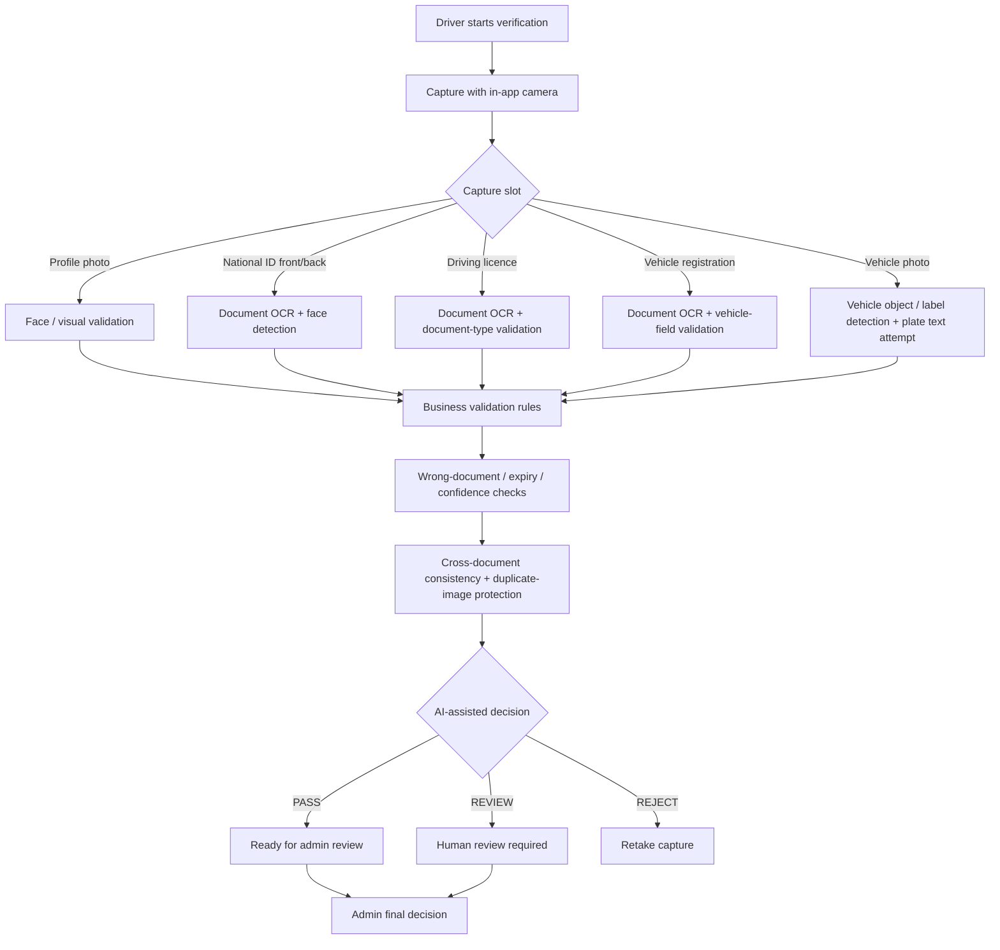

# 3ASEKKA Visual Showcase

> **VIEW-ONLY PORTFOLIO / CASE STUDY. NOT OPEN SOURCE.**
>
> This page contains no production source code, credentials, API secrets, signing material, private APIs, or private user data. **All rights reserved.**

## Core production UI

The gallery above is built from **actual project screenshots preserved in the production source archive** and shows five core product areas:

- Vehicle selection
- Order details
- Real-time driver bidding
- Live trip tracking
- Customer home

The high-resolution originals are kept privately with the project owner. The public repository intentionally contains only a reduced presentation image so it cannot be used as a substitute for the application source.

## OCR / AI verification — actual camera flow

Driver onboarding is **camera-first**. Required identity and vehicle evidence is captured from the app camera; it is not described as a generic document-file upload flow.

The source-backed verification architecture covers:

- Google Cloud Vision OCR
- Arabic / English document text extraction
- Face detection for profile / identity capture checks
- Vehicle label / object detection
- Plate-like text attempt on vehicle capture when visible
- National ID ↔ driving-licence consistency checks
- Vehicle registration ↔ vehicle / plate consistency checks
- Duplicate-image fingerprint protection
- Expiry / wrong-document / low-confidence handling
- `PASS` / `REVIEW` / `REJECT` machine states
- Final human admin approval / rejection / retake decision

**Important:** this is AI-assisted verification, not a claim of forensic Photoshop detection or 100% fraud-proofing.

## Search tags

#ReactNative #Expo #Supabase #GoogleCloudVision #OCR #ComputerVision #KYC #DocumentVerification #LogisticsApp #TransportApp #OnDemandTransport #UberLike #CareemLike #InDriveLike #DriverApp #GoogleMaps #GoogleRoutes #Realtime #Firebase #FCM #MobileAppDevelopment #EgyptTech #DriverOnboarding #BiddingSystem #LiveTracking #TransportSoftware

---

## Legal / use restriction

**PROPRIETARY — ALL RIGHTS RESERVED.**

Viewing this repository for evaluation is permitted. No open-source license is granted. No permission is granted to copy, modify, redistribute, deploy, reproduce, reverse engineer, commercially exploit, or create derivative products from the materials in this repository without prior written authorization from the project owner.