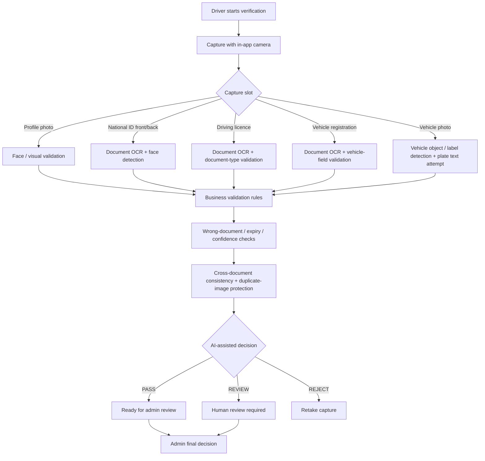

# 3ASEKKA Visual Showcase

> **VIEW-ONLY PORTFOLIO / CASE STUDY. NOT OPEN SOURCE.**
>
> This page contains no production source code, credentials, API secrets, signing material, private APIs, or private user data. **All rights reserved.**

## Complete platform ecosystem

3ASEKKA is a **full on-demand transport technology ecosystem**, not only a mobile UI project. The delivered product includes:

- **Mobile application** with separate Customer and Driver experiences
- **Public website:** `https://3asekka.com`
- **Customer / Driver web portal:** `https://3asekka.com/portal`
- **Admin / Owner Dashboard:** `https://3asekka.com/admin`
- **Backend + database + realtime infrastructure** for operational workflows
- **AI/OCR verification layer** for driver onboarding
- **AI voice / policy-audio automation layer**
- **Maps, route pricing, bidding, tracking, finance and communication systems**

The native client is one React Native / Expo application with role-specific customer and driver flows rather than falsely presenting two unrelated mobile codebases.

➡️ **Full programming stack and architecture:** [`PLATFORM_AND_TECH_STACK.md`](PLATFORM_AND_TECH_STACK.md)

### Core technologies

**React 19 · React Native 0.81.5 · Expo SDK 54 · TypeScript · React Native Web · Supabase · PostgreSQL · Realtime · Edge Functions · Google Maps · Google Routes · Google Cloud Vision OCR · ElevenLabs TTS integration · Firebase/FCM · Agora · Android/Gradle · Nginx/HTTPS**

## Core production UI

The gallery above is built from **actual project screenshots preserved in the production source archive** and shows five core product areas:

- Vehicle selection
- Order details
- Real-time driver bidding
- Live trip tracking
- Customer home

The high-resolution originals are kept privately with the project owner. The public repository intentionally contains only a reduced presentation image so it cannot be used as a substitute for the application source.

## OCR / AI verification — actual camera flow

Driver onboarding is **camera-first**. Required identity and vehicle evidence is captured from the app camera; it is not described as a generic document-file upload flow.

The source-backed verification architecture covers:

- Google Cloud Vision OCR
- Arabic / English document text extraction
- Face detection for profile / identity capture checks
- Vehicle label / object detection
- Plate-like text attempt on vehicle capture when visible
- National ID ↔ driving-licence consistency checks
- Vehicle registration ↔ vehicle / plate consistency checks
- Duplicate-image fingerprint protection
- Expiry / wrong-document / low-confidence handling
- `PASS` / `REVIEW` / `REJECT` machine states
- Final human admin approval / rejection / retake decision

**Important:** this is AI-assisted verification, not a claim of forensic Photoshop detection or 100% fraud-proofing.

## AI voice / safety-policy audio

The production Supabase backend also contains a dedicated **AI voice generation workflow** for safety and communication policy audio.

The deployed server-side flow can:

- Read configurable safety / communication policy text from backend settings
- Send the text to **ElevenLabs Text-to-Speech** using a server-side API credential
- Use a configurable voice ID and model
- Generate MP3 audio
- Store/upsert generated audio in **Supabase Storage**
- Save the resulting audio URL, transcript, voice metadata and model metadata back into platform settings
- Keep generation behind authenticated **admin-only** control

The policy-audio layer also supports pre-generated Egyptian voice assets. Existing platform configuration includes active audio URLs and an Egyptian voice label, so the case study distinguishes **AI voice capability/integration** from any unsupported claim about how every historical audio asset was produced.

## Search tags

#React #ReactJS #ReactNative #Expo #TypeScript #ReactNativeWeb #Supabase #PostgreSQL #EdgeFunctions #GoogleCloudVision #OCR #ComputerVision #KYC #DocumentVerification #ElevenLabs #TextToSpeech #AIVoice #LogisticsApp #TransportApp #OnDemandTransport #UberLike #CareemLike #InDriveLike #DriverApp #AdminDashboard #CustomerPortal #WebDevelopment #GoogleMaps #GoogleRoutes #Realtime #Firebase #FCM #Agora #MobileAppDevelopment #AndroidDevelopment #EgyptTech #DriverOnboarding #BiddingSystem #LiveTracking #TransportSoftware

---

## Legal / use restriction

**PROPRIETARY — ALL RIGHTS RESERVED.**

Viewing this repository for evaluation is permitted. No open-source license is granted. No permission is granted to copy, modify, redistribute, deploy, reproduce, reverse engineer, commercially exploit, or create derivative products from the materials in this repository without prior written authorization from the project owner.