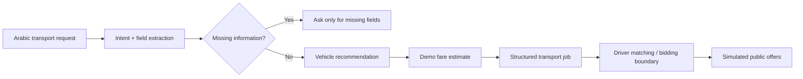

# 3ASEKKA AI Transport Agent

Public, isolated hackathon prototype for **Agents at Work 2026**.

## Problem

Egyptian SMEs, shops and merchants often arrange local goods transport manually through calls and informal driver networks. That can make vehicle selection, pricing, request structuring and driver coordination slow and inconsistent.

## Agent goal

Turn a natural Arabic request into an actionable local goods-transport job.

### Example input

```text
عايز أنقل 20 كرتونة من سموحة إلى المنشية بكرة الساعة 3، وزنهم حوالي 250 كيلو والمسافة 12 كم
```

### Example agent decisions

- Pickup: سموحة
- Destination: المنشية
- Cargo: 20 كرتونة
- Weight: 250 kg
- Requested time: tomorrow at 15:00
- Recommended vehicle: تروسيكل
- Fare: demo estimate
- Next action: create structured request and proceed to matching/bidding

## Current public prototype

The prototype is deliberately isolated from the production 3ASEKKA application.

It currently demonstrates:

- Arabic transport-intent parsing
- Missing-information detection
- Vehicle recommendation
- Demo fare estimation
- Structured transport-job output
- Safe simulated driver offers for the public demo
- A minimal Arabic RTL web interface

The production mobile application, private backend, real driver records, credentials and business-sensitive integrations remain private.

## Run locally

Requires Node.js 18+.

```bash
cd hackathon-agent
npm start
```

Then open:

```text
http://localhost:3000
```

Health check:

```text
http://localhost:3000/health
```

## Public-demo architecture



## Production integration boundary

The private production system already contains transport-request, vehicle, route, pricing, bidding and trip-lifecycle workflows. The hackathon agent is designed as a safe orchestration layer above those workflows.

For the public repository, production calls are intentionally replaced by isolated demo logic so no credentials, user data, private schema or production business logic are exposed.

## Next hackathon milestones

1. Add an LLM extraction adapter behind a provider-neutral interface.
2. Connect to a safe sandbox transport-request API.
3. Replace simulated offers with sandbox bidding events.
4. Record a 60–120 second demo video.
5. Add evaluation examples for Egyptian Arabic transport requests.

## Security

Never commit:

- `.env`
- Supabase service-role keys
- Google API secrets
- Firebase private keys
- signing keys
- production database dumps
- private user or driver data

Only `.env.example` belongs in this public repository.
