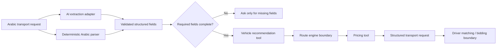

# 3ASEKKA AI Transport Agent

Public, isolated hackathon prototype for **Agents at Work 2026**.

## Problem

Egyptian SMEs, shops and merchants often arrange local goods transport manually through calls and informal driver networks. The operational problem is not merely answering customers: a transport request must be understood, completed, converted into structured data, routed to the right vehicle class, priced and prepared for driver matching.

## What the agent does

The user writes a natural Arabic request such as:

```text
عايز أنقل 20 كرتونة من سموحة إلى المنشية بكرة الساعة 3، وزنهم حوالي 250 كيلو والمسافة 12 كم
```

The agent then:

1. Extracts the transport intent and fields from Arabic.
2. Asks only for missing information.
3. Recommends a vehicle class using transport rules.
4. Calls the route/pricing stage when enough data exists.
5. Produces a structured transport job.
6. Prepares the job for driver matching and bidding.
7. Keeps production credentials and private integrations outside the public repository.

## AI + tools architecture

This version is no longer only a regex/parser demo.

When an AI provider is configured, the agent uses an LLM for natural-language extraction and combines that output with deterministic transport tools. Business decisions such as vehicle capacity and demo pricing are kept outside the model.

Supported adapters:

- Google Gemini via `GEMINI_API_KEY`
- OpenAI via `OPENAI_API_KEY`
- Generic OpenAI-compatible endpoint via `LLM_ENDPOINT`

If no AI key is configured, the same application automatically falls back to deterministic Arabic parsing so the public demo does not fail.



## Why this is agentic

The model is not allowed to invent business actions or pricing. The orchestration layer decides which tool/stage should run next:

- `extract_transport_request`
- `request_missing_information`
- `recommend_vehicle`
- `calculate_route`
- `estimate_fare`
- `prepare_transport_request`
- `driver_matching_and_bidding`

The public demo returns an explicit action trace so reviewers can see the sequence.

## Run locally

Requires Node.js 18+.

```bash
cd hackathon-agent
npm start
```

Open:

```text
http://localhost:3000
```

## Enable AI mode

Never commit the key. Set it only as a local/deployment environment variable.

Gemini example:

```bash
GEMINI_API_KEY=your_secret_key npm start
```

Or OpenAI:

```bash
OPENAI_API_KEY=your_secret_key OPENAI_MODEL=your_model npm start
```

The UI and `/api/status` clearly show whether AI mode is active.

## Evaluation

Run:

```bash
npm run eval
```

CI runs the deterministic evaluation suite on every hackathon-agent change, without any secret key.

## Production integration boundary

The private 3ASEKKA production system already contains transport request, route, pricing, vehicle, bidding and trip lifecycle workflows. The hackathon agent is an orchestration layer designed to sit above those capabilities.

The public repository intentionally does not include:

- production source code
- Supabase service-role keys
- Google/Firebase secrets
- signing keys
- production database schema/dumps
- private user or driver data
- private production pricing logic

Public driver offers remain simulated until a safe sandbox integration is connected.


## Public static live demo

A GitHub Pages workflow is included for a public zero-secret demo. On Pages, the UI uses a
browser-side deterministic fallback so no API key is exposed. For the strongest hackathon
recording, run the Node server with an AI provider key locally or on a server-side host.
